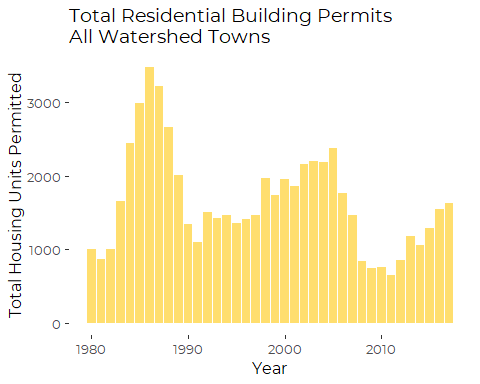
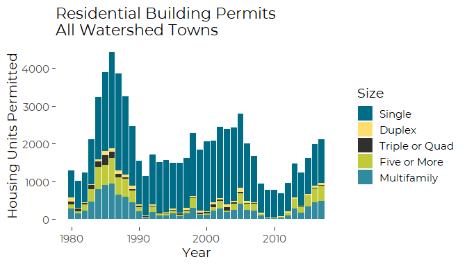
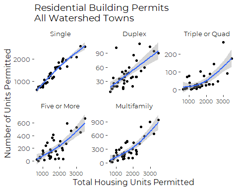
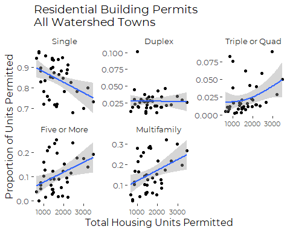

Building Permits Data
================
Curtis C. Bohlen, Casco Bay Estuary Partnership.
06/02/2022

-   [Introduction](#introduction)
-   [Load Libraries](#load-libraries)
-   [Folder References](#folder-references)
-   [Load Data](#load-data)
-   [Graphics](#graphics)
    -   [Total Building Permits 1980 through
        2018](#total-building-permits-1980-through-2018)
    -   [Hot Real Estate Markets](#hot-real-estate-markets)
        -   [All Sizes of Structures
            Increase](#all-sizes-of-structures-increase)
        -   [A Shift to Larger Units](#a-shift-to-larger-units)


# Introduction

Housing data and housing starts reflect economic activity and signal the
level of land use change ocurring at any given time. Federal sources
track and make public town by town data on housing permits. Here we
develop R code to produce graphics similar to the graphic on building
permits included in the State of Casco Bay report. (The actual graphic
used in the Report was produced in Excel. See the acompanying Excel
Spreadsheet for details).

# Load Libraries

``` r
library(tidyverse)
#> -- Attaching packages --------------------------------------- tidyverse 1.3.1 --
#> v ggplot2 3.3.5     v purrr   0.3.4
#> v tibble  3.1.6     v dplyr   1.0.7
#> v tidyr   1.1.4     v stringr 1.4.0
#> v readr   2.1.1     v forcats 0.5.1
#> -- Conflicts ------------------------------------------ tidyverse_conflicts() --
#> x dplyr::filter() masks stats::filter()
#> x dplyr::lag()    masks stats::lag()

library(CBEPgraphics)
load_cbep_fonts()
theme_set(theme_cbep())
```

# Folder References

``` r
sibfldnm <- 'Data'
parent <- dirname(getwd())
sibling <- paste(parent,sibfldnm, sep = '/')

#dir.create(file.path(getwd(), 'figures'), showWarnings = FALSE)
```

# Load Data

``` r
the_data <- read_csv(file.path(sibling, 'bldgpermits.csv'))
#> Rows: 1672 Columns: 9
#> -- Column specification --------------------------------------------------------
#> Delimiter: ","
#> chr (2): Town, County
#> dbl (7): Year, Total, Single, Multifamily, Duplex, TripQuad, QuintPlus
#> 
#> i Use `spec()` to retrieve the full column specification for this data.
#> i Specify the column types or set `show_col_types = FALSE` to quiet this message.
```

``` r
totals <- the_data %>%
  group_by (Year) %>%
  summarize(across(Total:QuintPlus, sum, na.rm = TRUE))
```

# Graphics

## Total Building Permits 1980 through 2018

``` r
ggplot(totals, aes(Year, Total)) +
  geom_col(fill = cbep_colors()[2]) +
  ylab("Total Housing Units Permitted") +
  ggtitle("Total Residential Building Permits\nAll Watershed Towns") +
  theme_cbep(base_size = 12)
```


\# Building Permits by Number of Units

``` r
totals %>%
  select(-Total) %>%
  pivot_longer(-Year, names_to = "Size", values_to = "Units") %>%
  mutate(Size = factor(Size, levels = c("Single", "Duplex", "TripQuad", 
                                        "QuintPlus", "Multifamily"),
                             labels = c("Single", "Duplex", "Triple or Quad", 
                                        "Five or More", "Multifamily"))) %>%
ggplot(aes(Year, Units, fill = Size)) +
  geom_col() +
  scale_fill_manual(values = cbep_colors()) +
  ylab("Housing Units Permitted") +
  ggtitle("Residential Building Permits\nAll Watershed Towns") +
  theme_cbep(base_size = 14)
```



It looks as though the proportion of single homes is inversely related
to the total number of permitted housing units. let’s first look at the
NUMBER of housing units permitted in each year,a s a function of the
total number permitted.

## Hot Real Estate Markets

### All Sizes of Structures Increase

``` r
 long_totals <- totals %>%  pivot_longer(-c(Year, Total), 
                               names_to = "Size", 
                               values_to = "Count") %>%
  mutate(Size = factor(Size, levels = c("Single", "Duplex", "TripQuad", 
                                        "QuintPlus", "Multifamily"),
                             labels = c("Single", "Duplex", "Triple or Quad", 
                                        "Five or More", "Multifamily")))
```

``` r
ggplot(long_totals, aes(Total, Count)) +
  geom_point() +
  geom_smooth(method = "gam", formula = y~s(x, k = 4)) +
  ylab("Number of Units Permitted") +
  xlab('Total Housing Units Permitted') +
  ggtitle("Residential Building Permits\nAll Watershed Towns") +
  facet_wrap(~Size, scales = 'free_y') +
  theme_cbep(base_size = 12) +
  theme(axis.text.x = element_text(size = 8))
```


When the housing market is hot, the number of all types of housing being
built goes up. The relationship is not wildly far from linear for any
size of housing (But note the different vertical scales!).

### A Shift to Larger Units

``` r
props <- totals %>%
  mutate(Single = Single/Total,
         Duplex = Duplex/Total,
         TripQuad = TripQuad / Total,
         QuintPlus = QuintPlus/Total,
         Multifamily = Multifamily / Total
         )
```

``` r
cor(props)
#>                    Year       Total     Single Multifamily      Duplex
#> Year         1.00000000 -0.34953030  0.2456284  -0.2456284 -0.18650511
#> Total       -0.34953030  1.00000000 -0.4071253   0.4071253 -0.02319135
#> Single       0.24562836 -0.40712532  1.0000000  -1.0000000 -0.36957157
#> Multifamily -0.24562836  0.40712532 -1.0000000   1.0000000  0.36957157
#> Duplex      -0.18650511 -0.02319135 -0.3695716   0.3695716  1.00000000
#> TripQuad    -0.66517142  0.31536907 -0.5226332   0.5226332  0.32390411
#> QuintPlus   -0.04547104  0.38562462 -0.9372529   0.9372529  0.12914433
#>               TripQuad   QuintPlus
#> Year        -0.6651714 -0.04547104
#> Total        0.3153691  0.38562462
#> Single      -0.5226332 -0.93725287
#> Multifamily  0.5226332  0.93725287
#> Duplex       0.3239041  0.12914433
#> TripQuad     1.0000000  0.23945232
#> QuintPlus    0.2394523  1.00000000
```

So, Years with lots of new housing units are also years with large
numbers of larger housing units, and a smaller proportion of single
family dwellings.

``` r
long_props <- props %>%  pivot_longer(-c(Year, Total), 
                               names_to = "Size", 
                               values_to = "Proportion") %>%
  mutate(Size = factor(Size, levels = c("Single", "Duplex", "TripQuad", 
                                        "QuintPlus", "Multifamily"),
                             labels = c("Single", "Duplex", "Triple or Quad", 
                                        "Five or More", "Multifamily")))
```

``` r
ggplot(long_props, aes(Total, Proportion)) +
  geom_point() +
  geom_smooth(method = "gam", formula = y~s(x, k = 4)) +
  ylab("Proportion of Units Permitted") +
  xlab('Total Housing Units Permitted') +
  ggtitle("Residential Building Permits\nAll Watershed Towns") +
  facet_wrap(~Size, scales = 'free_y') +
  theme_cbep(base_size = 12) +
  theme(axis.text.x = element_text(size = 8))
```



So, overall, when the housing market is hot, we tend to see construction
of relatively more multifamily structures. Single family dwellings are
90% of permitted dwellings when construction is slow, but drop to 75%
when construction is booming.

This is a correlation, so one should not interpret the results as simple
causation, because it is not at all clear which way the arrow of
causation runs, or if both values change simultaneously due to market
forces.
